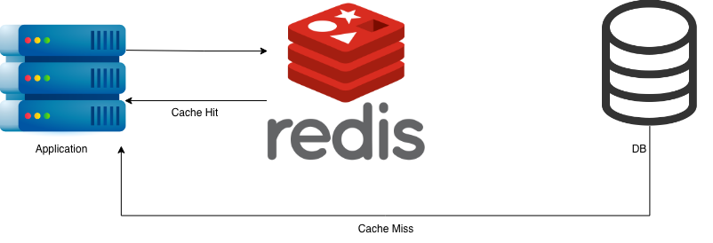

# Cache-Aside Pattern

애플리케이션이 데이터를 캐시에서 먼저 찾고, 없으면 DB를 조회해 캐시에 채워 넣는 가장 기본적인 캐싱 전략이다.

## 개념

- 캐시와 DB를 애플리케이션 코드가 직접 관리하는 방식 (캐시 라이브러리/DB가 알아서 동기화해주지 않음)
- 조회는 **캐시 우선(Look-aside)**, 쓰기는 **DB 우선 + 캐시 무효화(Invalidation)** 로 처리
- 캐시와 DB의 정합성을 애플리케이션이 책임지는 대신, 구조가 단순하고 어떤 캐시 저장소와도 조합 가능

## 동작 흐름


### 조회 (Read)
1. 애플리케이션이 캐시를 먼저 조회한다.
2. 캐시에 데이터가 있으면 바로 반환한다. (**Cache Hit**)
3. 캐시에 없으면 DB를 조회한다. (**Cache Miss**)
4. DB에서 조회한 데이터를 캐시에 저장한다.
5. 이후 요청부터는 캐시에서 바로 응답한다.

### 갱신 (Write)
쓰기 시점에는 캐시를 갱신하지 않고 **삭제**한다. 다음 조회에서 자연스럽게 Cache Miss → DB 재조회 → 재캐싱이 일어나며 최신 데이터로 채워지기 때문이다.

## 장점

- DB 부하 감소 (반복 조회를 캐시에서 흡수)
- 응답 속도 향상 (Cache Hit 시 DB 왕복 없음)

## 주의할 점

- 무분별하게 모든 데이터에 적용하면 오히려 손해 (캐시 갱신/무효화 비용, 메모리 비용 발생)
- 캐시와 DB 사이의 짧은 불일치 구간이 존재할 수 있음
- Cache Miss가 몰리는 순간 DB에 부하가 집중될 수 있음 

## 언제 적용하면 좋은가

| 적합한 경우 | 이유 |
| --- | --- |
| 읽기 비중이 높은 데이터 (공지사항, 상품 상세) | Cache Hit로 얻는 이득이 큼 |
| 자주 바뀌지 않는 데이터 | 캐시 무효화 빈도가 낮아 갱신 비용보다 조회 이득이 큼 |

반대로 **쓰기가 잦은 데이터**는 캐시 무효화가 빈번하게 발생해 캐싱 효과 대비 관리 비용이 커지므로 신중히 적용해야 한다.


## 캐시 무효화 전략 (Cache Invalidation)

DB 데이터를 수정/삭제했는데 캐시는 그대로 남아있으면, 다음 조회에서 Cache Hit가 발생해 **이미 낡은(stale) 데이터**를 정답인 것처럼 반환하게 된다. 캐시 무효화 전략은 이 정합성 문제를 막기 위해, **DB 데이터가 수정/삭제될 때 관련된 Redis 캐시도 함께 지워주는 것**이다.

### 왜 갱신이 아니라 삭제인가

캐시가 stale해지는 걸 막는 방법은 크게 두 가지다.

| 전략 | 방식 | 특징 |
| --- | --- | --- |
| 캐시 갱신 (Update) | DB 갱신과 동시에 캐시도 최신 값으로 덮어씀 | 캐싱 로직을 쓰기 경로에도 중복 구현해야 하고, 실수로 값이 어긋날 여지가 있음 |
| 캐시 무효화 (Invalidate) | DB 갱신 후 캐시를 삭제만 함 | 다음 조회가 자연스럽게 Cache Miss → DB 재조회 → 재캐싱을 하므로 항상 DB가 최종 소스 |


### 주의할 점
- 삭제와 갱신 순서가 바뀌면(캐시 먼저 지우고 DB 갱신이 나중) 그 사이 들어온 조회가 다시 stale 값을 캐싱해버릴 수 있으므로, **DB 갱신 → 캐시 삭제** 순서를 지켜야 한다.

## 이 예제의 구조

흐름을 한 번에 볼 수 있도록 Service 계층 없이 `Controller`에 캐시 조회/갱신 로직을 구현했다.

```
cacheaside
├── controller/UserCacheController.java   # Cache-aside 조회 및 무효화 로직
├── dto/UserProfile.java                  # 캐시/응답으로 사용되는 유저 프로필
├── dto/UserProfileUpdateRequest.java     # 갱신 요청 바디
└── repository/FakeUserStore.java         # DB를 대신하는 인메모리 저장소
```

- `GET /user/{userId}` → 캐시 조회 → Miss 시 DB 조회 후 캐싱 (TTL 300초)
- `PUT /user/{userId}` → DB 갱신 → 캐시 삭제 (Invalidation)


